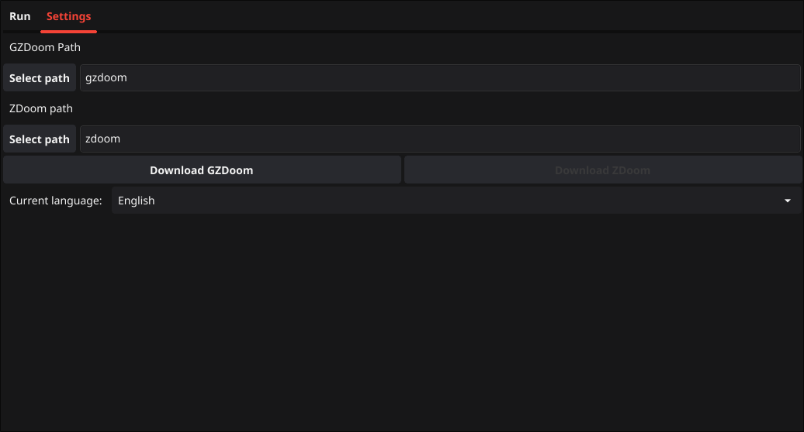

# GZGoLauncher

A cross-platform launcher for *ZDoom

## Features

- Light/dark mode toggle
- Cross-platform
- Assisted download of GZDoom/ZDoom

## Binary Installation

Install GZGoLauncher with Go or by executing the binary in its own folder.

### Windows

1. Download the package from [releases](https://github.com/Tom5521/GZGoLauncher/releases/latest)
for your architecture.

2. Unzip the package

3. Run GZGoLauncher.exe; the binary is completely portable.

### MacOS

1. Download the package from [releases](https://github.com/Tom5521/GZGoLauncher/releases/latest)
for your architecture.

2. Unzip the package and move GZGoLauncher.app to your Applications folder,
or you can execute the binary in GZGoLauncher.app/Contents/MacOS/GZGoLauncher.

### Linux

1. Download the package from [releases](https://github.com/Tom5521/GZGoLauncher/releases/latest)
for your architecture.

2. Untar the package and cd into the folder.

3. Run `make install` or `make user-install` for user local installation.

## Build & Install

Install with Go on all systems:

```bash
go install -v github.com/Tom5521/GZGoLauncher/cmd/GZGoLauncher@latest
```

### On Linux

Linux requirements:

- C compiler
- Go compiler
- Mage
- Fyne Package
- Git

```bash
git clone https://github.com/Tom5521/GZGoLauncher
cd GZGoLauncher
git checkout <latest version>
mage install:user # mage install:root for root installation
```

### On Windows

Windows requirements:

- C compiler
- Go compiler
- Git
- Zip (to release the package)
- 7z (to unzip the opengl32.dll file)
- Mage
- Fyne Package
- x86_64-w64-mingw32-gcc (on non-Windows systems)

```batch
git clone https://github.com/Tom5521/GZGoLauncher
cd GZGoLauncher
git checkout <latest version>
mage build:windows
# Go to the builds folder and run GZGoLauncher.exe
# Then run the executable, and you're done!
# The Windows and Linux executables are fully portable
```

### On macOS

macOS requirements:

- Command-line tools (On non-Mac systems)
- o32-clang (Optional, On non-Mac systems)
- Fyne Package
- C compiler
- Go compiler
- Mage
- Fyne package
- Zip (To release the package)

```bash
git clone https://github.com/Tom5521/GZGoLauncher
cd GZGoLauncher
git checkout <latest version>
mage build:defaultMac
# Now move GZGoLauncher.app to the Applications folder
# Theoretically, it should already be installed
```

You can also download the binaries and unzip them to run them in a portable way.

## Screenshots




<https://github.com/Tom5521/GZGoLauncher/assets/88908582/d9692c54-9dfa-4f68-b89e-4828cc160daa>

## License

[MIT](https://choosealicense.com/licenses/mit/)
