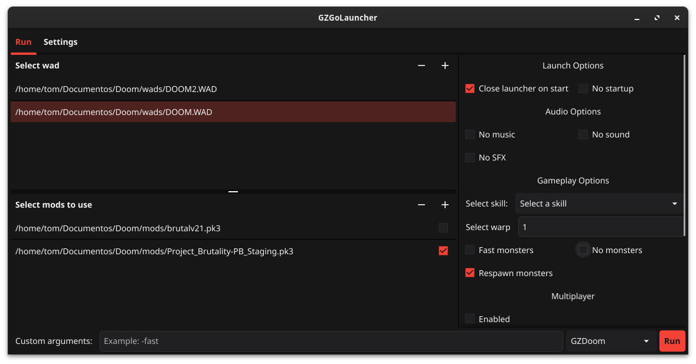

# GZGoLauncher

A cross-platform launcher for gzdoom

## Features

- Light/dark mode toggle
- Cross platform
- Auto download gzdoom/zdoom (later)

## Installation

Install my-project with go or by executing the binary in its own folder

Install with go:

```bash
go install -v https://github.com/Tom5521/GZGoLauncher/cmd/GZGoLauncher@latest
```

You can compile it, you need:

- C compiler
- Go compiler
- Mage
- wget
- xz (on linux)
- winrar/7zip (on windows)
- Git
- Fyne Package (Optionally)

Compiling and installing in Linux

```bash
git clone https://github.com/Tom5521/GZGoLauncher
git checkout <latest version>
mage install:user # mage install:root for root installation
```

On Windows

```batch
git clone https://github.com/Tom5521/GZGoLauncher
git checkout <latest version>
mage build:windows
# Go to builds folder and run GZGoLauncher.exe
# Then run the executable, and done!
# The windows(and linux executable is fully portable)
```

You can also download the binaries and unzip them, to run them in a portable way,
or installing with make install in linux

## Screenshots



## License

[MIT](https://choosealicense.com/licenses/mit/)
