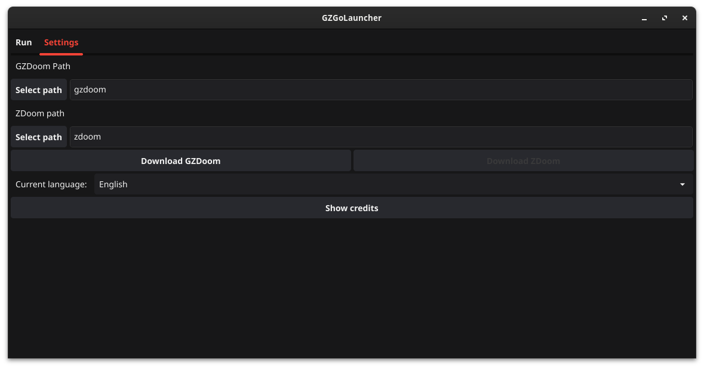

# GZGoLauncher

A cross-platform launcher for *ZDoom

## Features

- Light/dark mode toggle
- Cross-platform
- Assisted download of GZDoom/ZDoom

## Installation

The information on how to install it has been moved to the [wiki](https://github.com/Tom5521/GZGoLauncher/wiki/install-home)

## Build

The information on how to compile it was moved to [wiki](https://github.com/Tom5521/GZGoLauncher/wiki/compile-home)

## Screenshots

<https://github.com/Tom5521/GZGoLauncher/assets/88908582/d9692c54-9dfa-4f68-b89e-4828cc160daa>

## License

[MIT](https://choosealicense.com/licenses/mit/)

## Notes:

This app was created listening to 
[this](https://www.youtube.com/playlist?list=PLpShJAhHjyQws83odym7Q9mZ82wxvnRfw)
playlist :v
